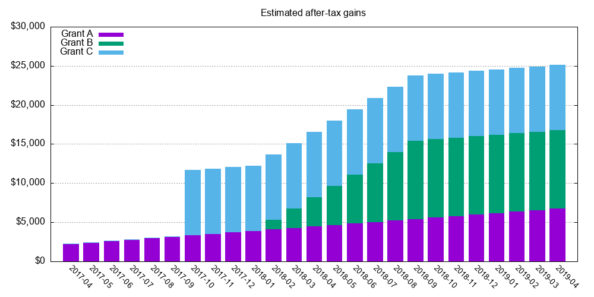

# vesting

A small program to print a vesting chart for awarded stock grants. You configure a file like [example.edn](example.edn), then run

```
clojure -m vesting example.edn | gnuplot | feh -
```

and you see something this:



For this to work you will need the programs involved in the pipeline, i.e.

 * Clojure
 * Gnuplot
 * feh, or any other image viewer

You can also adjust the valuation by passing a parameter to see how the portfolio behaves:

```
clojure -m vesting example.edn 2800 | gnuplot | feh -
```
